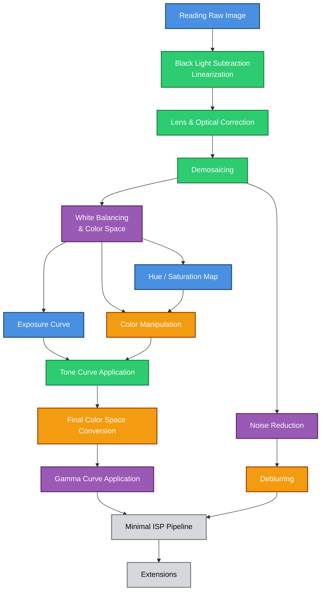

# Planning, Deadlines and Project Organization
## Task deadlines

**Note :** This is a first version of a planning, consider that : 
- Dates for May and June will be defined later.
- Debugging and documentation sessions will be added gradually.
- Planning may change after according to how well things are implemented.

The delegate assignee's role is to be in charge of any task if the current assignee is no longer available for it.

New Schedule

| Task to implement | Subtask| Assignee | Delegate | V0 Prévue | V0 Réalisée | V1 Prévue | V1 Réalisée | V2 Prévue | V2 Réalisée |
| --- | --- | --- | --- | --- | --- | --- | --- | --- | --- |
| **Reading Raw Image** | | Amayas | N/A | N/A | N/A | N/A | N/A | N/A | N/A |
| **Black Light Subtraction, linearization** | | Ghiles | Amayas | N/A | N/A | N/A | N/A | N/A | N/A |
| **Lens and Optical Correction** | | Ghiles | Amayas | N/A | N/A | N/A | N/A | N/A | N/A |
| **Demosaicing** | | Ghiles | Amayas | N/A | N/A | N/A | N/A | N/A | N/A |
| **Noise Reduction** | | Rayane | Charlotte | N/A | N/A | N/A | N/A | N/A | N/A |
| **White Balancing & Color Space** | | Rayane | Charlotte | N/A | N/A | N/A | N/A | N/A | N/A |
| **Hue/Sat Map** | | Amayas | Ghiles | N/A | N/A | N/A | N/A | N/A | N/A |
| **Exposure Curve** | | Amayas | Ghiles | N/A | N/A | N/A | N/A | N/A | N/A |
| **Color Manipulation** | | Charlotte | Rayane | | | | | | |
| | **Temperature** | Charlotte | Rayane | 05/03/2026 | 01/03/2026 | 02/04/2026 | 02/03/2026 | N/A | N/A |
| | **Apply LUT** | Charlotte | Rayane | 05/03/2026 | 07/03/2026 (with bugs) | 02/04/2026 | 14/04/2026 | N/A | N/A |
| | **Saturation hsv** | Charlotte | Rayane | 02/04/2026 | 31/03/2026 | N/A | N/A | N/A | N/A |
| | **Contrast** | Charlotte | Rayane | 26/06/2026 | 17/05/2026 | N/A | N/A | N/A | N/A |
| **Tone Curve Application** | | Ghiles | Amayas | N/A | N/A | N/A | N/A | N/A | N/A |
| **Gamma Curve Application** | | Rayane | Charlotte | N/A | N/A | N/A | N/A | N/A | N/A |
| **Deblurring** | | Charlotte | Rayane | 19/03/2026 | 29/03/2026 | 21/06/2026 | 15/06/2026 | N/A | N/A |
| **JPEG Compression** | | | Amayas | N/A | N/A | N/A | N/A | N/A | N/A |
| **Extensions** | | | | N/A | N/A | N/A | N/A | N/A | N/A |

Ancient Schedule

| Task to implement | Assignee | Delegate | V0 Prévue | V0 Réalisée | V1 Prévue | V1 Réalisée | V2 Prévue | V2 Réalisée |
| --- | --- | --- | --- | --- | --- | --- | --- | --- |
| **Reading Raw Image** | Amayas | N/A | 19/02/2026 | N/A | N/A | N/A | N/A | N/A |
| **Black Light Subtraction, linearization** | Ghiles | Amayas | 19/02/2026 | N/A | 05/03/2026 | N/A | N/A | N/A |
| **Lens and Optical Correction** | Ghiles | Amayas | 12/03/2026 | N/A | 26/03/2026 | N/A | N/A | N/A |
| **Demosaicing** | Ghiles | Amayas | 19/02/2026 | N/A | 19/03/2026 | N/A | N/A | N/A |
| **Noise Reduction** | Rayane | Charlotte | 12/03/2026 | N/A | 10/05/2026 | N/A | N/A | N/A |
| **White Balancing & Color Space** | Rayane | Charlotte | 26/02/2026 | N/A | 05/03/2026 | N/A | N/A | N/A |
| **Hue/Sat Map** | Amayas | Ghiles | 26/02/2026 | N/A | 19/03/2026 | N/A | N/A | N/A |
| **Exposure Curve** | Amayas | Ghiles | 05/03/2026 | N/A | 26/03/2026 | N/A | N/A | N/A |
| **Color Manipulation** | Charlotte | Rayane | 05/03/2026 | N/A | 02/04/2026 | N/A | N/A | N/A |
| **Tone Curve Application** | Ghiles | Amayas | 05/03/2026 | N/A | 26/03/2026 | N/A | N/A | N/A |
| **Final Color Space Conversion** | Charlotte | Rayane | 12/03/2026 | N/A | 16/04/2026 | N/A | N/A | N/A |
| **Gamma Curve Application** | Rayane | Charlotte | 05/03/2026 | N/A | 12/03/2026 | N/A | N/A | N/A |
| **Deblurring** | Charlotte | Rayane | 19/03/2026 | N/A | 30/04/2026 | N/A | N/A | N/A |
| **JPEG Compression** | | | N/A | N/A | N/A | N/A | N/A | N/A |
| **Extensions** | | | N/A | N/A | N/A | N/A | N/A | N/A |

 - **V0 :** Minimum viable feature
 - **V1 :** Upgraded feature with other algorithms
 - **V2 :** Final version

## Tasks Dependence Graph
This graph represents the timeline dependencies for implementing an ISP pipeline.
The relationships between tasks indicate priority in terms of testing, not implementation order.

Color codes for task assignees:

- 🔵 Amayas
- 🟢 Ghiles
- 🟣 Rayane
- 🟠 Charlotte

## Milestones
| Goals | Assignee | Deadline |
| --- | --- | --- |
| **Minimal ISP pipeline** | Amayas | 12/03/2026 |
| **Additional algorithms and features (at least two for each node)** | Amayas | N/A
| **Mi-projet** | Ghiles | 07/04/2026 | 
| **Rapport "Enjeux"** | Charlotte | 08/05/2026 |
| **Audit P2P** | Rayane | 22/05/2026
| **Livraison poster** | Amayas | 17/06/2026
| **Fin de projet** | Ghiles | 22/06/2026 |
| **Présentation Hall** | Rayane | 26/06/2026 |

## Miscellanous
| Activity | Description of activity | Date |
| --- | --- | --- |
| **Minimal ISP Pipeline Documentation Check** | Reading and evaluating others documentation for the minimal ISP pipeline | 12/03/2026 | 
| **Evaluating advancement** | Checking what others did during the week and getting information about it | Every Thursday Afternoon | 
| **Usual Documentation Check** | Check for the documentation written by others, give advices and correct errors | Every Thursday Afternoon | 
| **Debugging Sessions** | Organizing debugging sessions to correct bugs and enhance coding quality | During Artishow Sessions | 
| **Planning Checkout** | Adapt planning for what's comming and define what extensions to add | 23/04/2026
| **Meetings with Quentin Bammey** | Every week meeting with Quentin Bammey to discuss technical aspects, difficulties and define extensions | Every Week | 
| **Meetings with Christian Sandor** | Generally once a month, to discuss furthuer features, especially about ComfyUI software | Every Month 
