# ComfyUI Nodes & Image Processing API Reference

Comprehensive documentation of all Image Signal Processing (ISP) custom nodes for ComfyUI, their parameters, algorithms, and direct Python API usage. This document covers the modular image processing pipeline integrated into ComfyUI through 12 custom nodes.

## Table of Contents

1. [Overview](#overview)
2. [RAW Input Node](#raw-input-node)
3. [Black Level Subtraction](#black-level-subtraction)
4. [Demosaicing Nodes](#demosaicing-nodes)
   - [Bilinear Demosaicing](#bilinear-demosaicing)
   - [Malvar-He-Cutler Demosaicing](#malvar-he-cutler-demosaicing)
5. [White Balance Nodes](#white-balance-nodes)
   - [Camera White Balance](#camera-white-balance)
   - [Gray World White Balance](#gray-world-white-balance)
   - [White Patch Reference](#white-patch-reference)
   - [Ground Truth White Balance](#ground-truth-white-balance)
   - [White Balance Comparison](#white-balance-comparison)
6. [Exposure Compensation](#exposure-compensation)
7. [Gamma Correction](#gamma-correction)
8. [JPEG Export Node](#jpeg-export-node)
9. [Complete Pipeline Examples](#complete-pipeline-examples)
10. [Python API Usage (Without ComfyUI)](#python-api-usage-without-comfyui)
11. [Best Practices](#best-practices)
13. [Appendix](#appendix)

---

## Overview

### Pipeline Architecture

The ISP (Image Signal Processing) pipeline processes raw camera sensor data through a series of transformations to produce finalized images. The recommended processing order is:

```
RAW Input
    ↓
Black Level Subtraction (Linearization)
    ↓
Demosaicing (Bayer → RGB)
    ↓
White Balance
    ↓
Exposure Compensation
    ↓
Gamma Correction
    ↓
JPEG Export
```

**Note:** Each node is optional and can be combined flexibly. However, the order above represents the recommended physical order for optimal image quality. Deviation from this order may produce unexpected results.

### Data Types & Transformations

The pipeline strictly enforces these data types at each stage. Using incompatible data types will cause algorithms to crash.

| Stage | Format | Dtype | Range | Description |
|-------|--------|-------|-------|-------------|
| **RAW Input** | (H, W) | uint16 | [0, 65535] | Raw Bayer sensor data from camera |
| **After Linearization** | (H, W) | float32 | [0, 1] | Black-subtracted and normalized Bayer pattern |
| **After Demosaicing** | (H, W, 3) | float32 | [0, 1] | Full RGB image, normalized |
| **After Processing** | (H, W, 3) | float32 | [0, 1] | Can exceed [0, 1] after exposure/gamma |
| **JPEG Export** | (H, W, 3) | uint8 | [0, 255] | Final 8-bit JPEG image |

### Key Concepts

- **Bayer Pattern (CFA):** Color Filter Array pattern indicating which color channel each pixel captures. Common patterns: RGGB, BGGR, GRBG, GBRG.
- **Linearization:** Removing black level (sensor noise floor) and normalizing to [0, 1] range.
- **Demosaicing:** Interpolating missing color values to create full RGB from Bayer pattern.
- **White Balance:** Correcting color temperature by scaling RGB channels.
- **Exposure:** Adjusting brightness using EV (Exposure Value) scale.
- **Gamma Correction:** Applying perceptual brightness mapping (typically sRGB with γ=2.2).

---

## RAW Input Node

### Description

Reads raw sensor data from camera-native formats (currently supporting Sony `.arw` files) and extracts the Bayer pattern mosaic with associated metadata (black/white levels, white-balance gains, CFA pattern).

**Status:** Core node, always first in pipeline  
**Category:** image  
**Deprecated:** No

### ComfyUI Interface

**Node Name:** `Read RAW Sensor`  
**Category:** image  
**Outputs:** 5

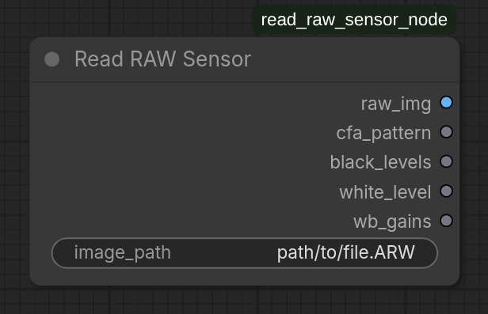

#### Input Parameters

| Parameter | Type | Units | Range | Default | Notes |
|-----------|------|-------|-------|---------|-------|
| `image_path` | STRING | — | File path | "input/image.ARW" | Absolute or relative path to raw sensor file |

#### Output Schema

| Output | Tensor Shape | Dtype | Range | Description |
|--------|--------------|-------|-------|-------------|
| **raw_img** | (H, W, 1) | float32 | [0, 65535] | Bayer mosaic sensor values |
| **cfa_pattern** | (H, W) | int32 | {0, 1, 2, 3} | Color pattern indices: 0=R, 1=Gr, 2=B, 3=Gb |
| **black_levels** | (4,) | float32 | ≥0 | Per-channel black offset from sensor |
| **white_level** | (1,) | float32 | >0 | Sensor white clipping level |
| **wb_gains** | (4,) | float32 | >0 | Camera-computed white-balance gains [R, Gr, B, Gb] |

### Algorithm Details

The node uses `rawpy` library to interpret raw files:

1. **File Reading:** Loads raw binary data from sensor-specific format
2. **CFA Extraction:** Extracts Bayer mosaic pattern (typically 2×2 repeating)
3. **Metadata Parsing:** Extracts camera-specific calibration from EXIF/metadata
   - **Black Levels:** Noise floor per color channel
   - **White Level:** Maximum sensor value before clipping
   - **WB Gains:** Color temperature adjustment from camera auto-white-balance
4. **Tensor Creation:** Returns PyTorch tensors with proper shapes and dtypes

### ComfyUI Usage

**Step-by-step:**

1. Right-click in canvas → Add Node → image → "Read RAW Sensor"
2. In the node properties panel:
   - Set **image_path** to your `.arw` file location
   - Supports both absolute paths (`/home/user/photo.arw`) and relative paths (`input/photo.arw`)

**Example paths:**
```
input/vacation_2025_01.arw
/media/camera/raw_exports/product_shot_01.arw
../samples/sony_a7_sample.arw
```

### File Format Support

Currently supported:
- **Sony Alpha (α):** All `.arw` format variants
  - Alpha 7R series (high-resolution)
  - Alpha 6000 series (mirrorless)
  - Most Sony DSLRs

Via `rawpy` library (transparent):
- Canon `.cr2`, `.crw`
- Nikon `.nef`, `.nrw`
- Fujifilm `.raf`
- Olympus `.orf`
- Panasonic `.rw2`
- [Full list: rawpy documentation](https://letmaik.github.io/rawpy/)

### Python API

```python
from src.algorithms.raw.reader import read_raw_sensor_data
import torch

# Read raw file
raw_data, metadata = read_raw_sensor_data(
    file_path="input/sony_image.arw"
)

# Inspect data
print(f"Raw shape: {raw_data.shape}")           # torch.Size([3456, 5184])
print(f"Raw dtype: {raw_data.dtype}")           # torch.float32
print(f"Raw range: [{raw_data.min()}, {raw_data.max()}]")  # [0.0, 65535.0]

# Access metadata (dict)
print(f"Black levels: {metadata['black_levels']}")  # array([512, 512, 512, 512])
print(f"White level: {metadata['white_level']}")    # 65535
print(f"WB gains: {metadata['wb_gains']}")          # array([2.0, 1.0, 1.5, 1.0])
```

### Error Handling

| Error | Cause | Solution |
|-------|-------|----------|
| `FileNotFoundError` | File path doesn't exist | Verify file path, use absolute paths when uncertain |
| `ValueError: Unsupported camera model` | Format not recognized by rawpy | Convert to supported format or use DNG |
| `CorruptedFileError` | Corrupted raw file | Re-download or re-capture the image |

### Performance Notes

- **Memory:** Raw image scales with sensor resolution. For 61MP camera: ~145 MB per image
- **Speed:** ~500-1000ms per file (format-dependent)
- **GPU:** CPU-only operation (file I/O)

---

## Black Level Subtraction

### Description

**Linearization node** that removes the sensor's black level offset and normalizes the Bayer image to [0, 1] range. This is essential for correct subsequent processing, as it accounts for camera-specific per-channel black levels.

**Status:** Recommended second stage (after RAW input)  
**Category:** image  
**Outputs:** 2

### ComfyUI Interface

**Node Name:** `Black Level Subtraction`  
**Category:** image  

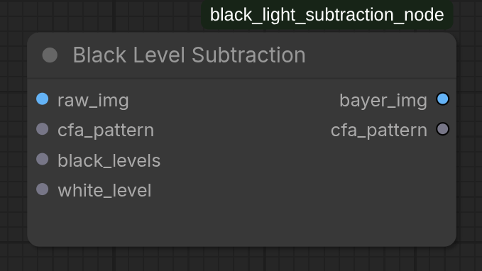

#### Input Parameters

| Input | Tensor Shape | Dtype | Range | Source | Notes |
|-------|--------------|-------|-------|--------|-------|
| **bayer_img** | (H, W, 1) | float32 | [0, 65535] | From RAW Input node | Raw sensor values |
| **cfa_pattern** | (H, W) | int32 | {0, 1, 2, 3} | From RAW Input node | Color filter array pattern |
| **black_levels** | (4,) | float32 | ≥0 | From RAW Input node | Per-channel black offset |
| **white_level** | (1,) | float32 | >0 | From RAW Input node | Sensor white point |

#### Output Schema

| Output | Tensor Shape | Dtype | Range | Description |
|--------|--------------|-------|-------|-------------|
| **linearized_img** | (H, W, 1) | float32 | [0, 1] | Black-subtracted and normalized Bayer |
| **cfa_pattern** | (H, W) | int32 | {0, 1, 2, 3} | Unchanged pattern (passthrough) |

### Algorithm Details

**Mathematical formulation:**

For each pixel at position (i, j) with CFA channel c:

$$\text{linear}_{i,j} = \frac{\text{raw}_{i,j} - \text{black}_{c}}{\text{white}_{\text{level}} - \text{black}_{c}}$$

where:
- $\text{black}_c$ is the black level for the color channel at that pixel position
- $\text{white}_{\text{level}}$ is the absolute sensor white level (typically 65535 for 16-bit sensors)
- Result is clamped to [0, 1]

**Steps:**

1. **Create Black Level Map:** For each pixel, map its CFA channel to the correct black level value
2. **Subtract Black:** Pixel-wise subtraction of black level
3. **Normalize:** Divide by (white_level - black_level) to scale to [0, 1]
4. **Clamping:** Clamp to [0, 1] range to handle edge cases

### ComfyUI Usage

**Step-by-step:**

1. Connect **raw_img**, **cfa_pattern**, **black_levels**, **white_level** from "Read RAW Sensor" node to this node
2. No parameters to adjust (fully automatic)
3. Connect **linearized_img** to next processing stage (typically Demosaicing)

**Visual flow in ComfyUI:**
```
[Read RAW Sensor] 
    → raw_img, cfa_pattern, black_levels, white_level
    ↓
[Black Level Subtraction] (automatic)
    → linearized_img, cfa_pattern
    ↓
[Demosaicing Node]
```

### Python API

```python
from src.algorithms.black_light_subtraction.black_light_subtraction import linearize_raw
import torch
import numpy as np

# Example with synthetic data
H, W = 3456, 5184
raw_img = torch.randint(512, 65535, (H, W), dtype=torch.float32)
cfa_pattern = torch.zeros((H, W), dtype=torch.int32)
# RGGB pattern (0=R, 1=Gr, 2=B, 3=Gb)
cfa_pattern[0::2, 0::2] = 0  # Red
cfa_pattern[0::2, 1::2] = 1  # Green
cfa_pattern[1::2, 0::2] = 3  # Green
cfa_pattern[1::2, 1::2] = 2  # Blue

black_levels = torch.tensor([512.0, 512.0, 512.0, 512.0])
white_level = torch.tensor([65535.0])

# Linearize
linearized, pattern_out = linearize_raw(
    raw_img=raw_img,
    bayer_pattern=cfa_pattern,
    black_levels=black_levels,
    white_level=white_level
)
```

### Performance Notes

- **Speed:** ~10-50ms for typical image sizes
- **Memory:** In-place operations, minimal overhead
- **Numerical Stability:** Uses floating-point to avoid integer overflow

---

## Demosaicing Nodes

Demosaicing reconstructs a full RGB image from the Bayer pattern (color filter array) mosaic. Each pixel in a Bayer array captures only one color channel; demosaicing estimates the missing two channels through interpolation.

### Overview: Bilinear vs. Malvar-He-Cutler

| Aspect | Bilinear | Malvar-He-Cutler |
|--------|----------|------------------|
| **Speed** | Fast (~50ms) | Slower (~200ms) |
| **Quality** | Good, may have artifacts | Excellent, professional-grade |
| **Artifacts** | Aliasing, banding | Minimal |
| **Use Case** | Preview, real-time | Production, analysis |
| **Kernel Size** | 4-neighbor adaptive | 5×5 directional kernels |
| **Best For** | Fast iteration | Final output |

### Bilinear Demosaicing

**Description**

Simple and fast demosaicing using 4-neighbor bilinear interpolation. Suitable for quick previews but may exhibit aliasing artifacts on high-frequency content (fine patterns, text, hair).

**Status:** Fast alternative  
**Category:** image  
**Outputs:** 1

#### ComfyUI Interface

**Node Name:** `Bilinear Demosaicing`  
**Category:** image

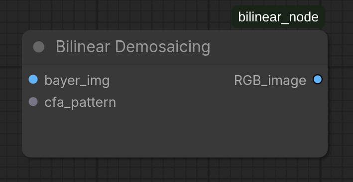

#### Input Parameters

| Input | Tensor Shape | Dtype | Range | Notes |
|-------|--------------|-------|-------|-------|
| **bayer_img** | (H, W, 1) | float32 | [0, 1] | Linearized Bayer from Black Level Subtraction |
| **cfa_pattern** | (H, W) | int32 | {0, 1, 2, 3} | Pattern from RAW Input or Linearization |

#### Output Schema

| Output | Tensor Shape | Dtype | Range | Description |
|--------|--------------|-------|-------|-------------|
| **RGB_image** | (H, W, 3) | float32 | [0, 1] | Full RGB demosaiced image |

#### Algorithm Details

**Bayer to RGB Conversion:**

The algorithm detects the Red pixel position (dy, dx) in the top-left 2×2 of the CFA pattern:

```
If RGGB:        If BGGR:        If GRBG:        If GBRG:
[R  Gr]         [B  Gb]         [Gr R ]         [Gb B ]
[Gb B ]         [G  R ]         [B  Gb]         [R  G ]

→ dy=0, dx=0    → dy=0, dx=1    → dy=1, dx=0    → dy=1, dx=1
```

**Interpolation:**

1. **Green Channel Interpolation:**
   - At Red/Blue pixels: Use cross-shaped kernel (4 neighbors)
   - Kernel: ¼[0, 1, 0; 1, 0, 1; 0, 1, 0]

2. **Red Channel Interpolation:**
   - At Blue/Green pixels: Interpolate from neighboring Red values
   - At Green-Red pixel: Use horizontal kernel
   - At Green-Blue pixel: Use vertical kernel

3. **Blue Channel Interpolation:**
   - At Red/Green pixels: Interpolate from neighboring Blue values
   - Similar to Red but opposite positions

**Complexity:** O(H×W) with small constant factor  
**Memory:** Minimal (streaming computation)

### ComfyUI Usage: Bilinear

**Step-by-step:**

1. Connect **linearized_img** and **cfa_pattern** from Black Level Subtraction node
2. No parameters to adjust (fully automatic)

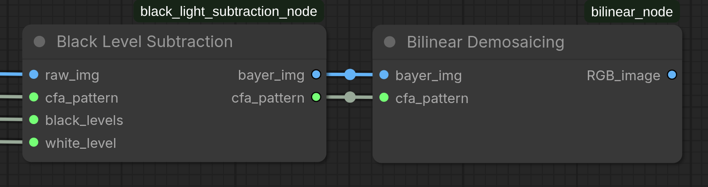

**When to use:**
- Real-time preview during parameter tuning
- Quick iteration cycles
- If final quality is not critical

### Malvar-He-Cutler Demosaicing

**Description**

High-quality demosaicing using directional convolution kernels. This is the preferred method for production output, as it minimizes both aliasing and color fringing artifacts through more sophisticated interpolation.

**Status:** Recommended for final output  
**Category:** image/processing  
**Outputs:** 1

#### ComfyUI Interface

**Node Name:** `Malvar-He-Cutler Demosaicing`  
**Category:** image/processing

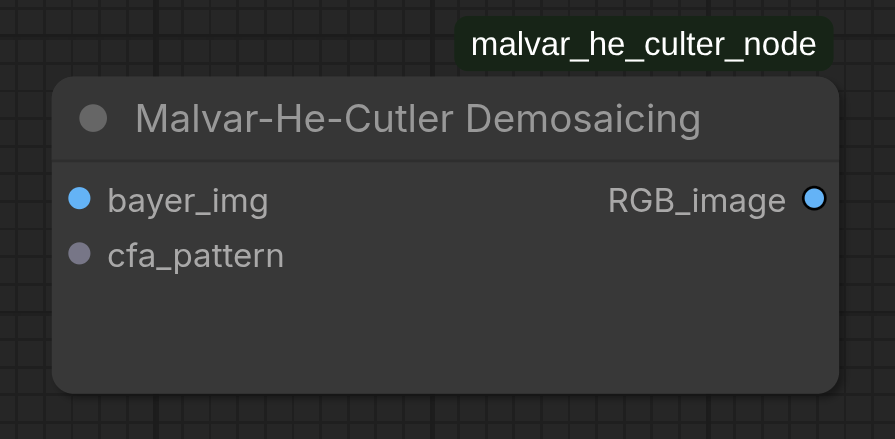

#### Input Parameters

| Input | Tensor Shape | Dtype | Range | Notes |
|-------|--------------|-------|-------|-------|
| **bayer_img** | (H, W, 1) | float32 | [0, 1] | Linearized Bayer from Black Level Subtraction |
| **cfa_pattern** | (H, W) | int32 | {0, 1, 2, 3} | Pattern from RAW Input or Linearization |

#### Output Schema

| Output | Tensor Shape | Dtype | Range | Description |
|--------|--------------|-------|-------|-------------|
| **RGB_image** | (H, W, 3) | float32 | [0, 1] | Full RGB demosaiced image (high quality) |

#### Algorithm Details

**Three-Stage Process:**

**Stage 1: Green Channel Estimation**
- At R/B locations: Estimate missing green using 5×5 kernel
- Green estimation minimizes color difference (key for quality)
- Kernel size: 5×5

**Stage 2: Red/Blue Cross-Channel Estimation**
- At B locations: Estimate red channel
- At R locations: Estimate blue channel
- Kernel size: 5×5

**Stage 3: Final High-Frequency Correction**
- Estimate difference between R and G, B and G
- Uses directional kernels (horizontal vs. vertical)
- Adds back high-frequency details lost in smoothing

**Directional Kernels:**

The algorithm employs separate horizontal and vertical kernels to preserve edge sharpness:

```
Horizontal emphasis kernel (detecting horizontal edges):
[-1/2  0  1/2]
[-1    0   1 ]
[-1/2  0  1/2]

Vertical emphasis kernel (detecting vertical edges):
[-1/2  -1  -1/2]
[ 0    0    0  ]
[1/2   1   1/2]
```

**Mask System:**

Creates 4 mask maps for different pixel types:
- **R-Mask:** Marks Red channel pixels
- **B-Mask:** Marks Blue channel pixels  
- **Gr-Mask:** Marks Green-Red pixels
- **Gb-Mask:** Marks Green-Blue pixels

Each mask guides interpolation for that color.

### ComfyUI Usage: Malvar-He-Cutler

**Step-by-step:**

1. Connect **linearized_img** and **cfa_pattern** from Black Level Subtraction node
2. No parameters to adjust (fully automatic)

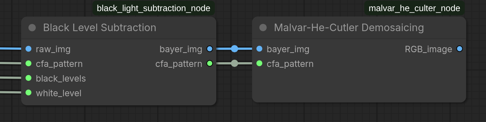

**When to use:**
- Final production output
- High-quality analysis
- When image contains fine details (patterns, text)
- When color accuracy is critical

### Demosaicing: Python API

```python
from src.algorithms.demosaicing._bilinear import bilinear_demosaicing
from src.algorithms.demosaicing._malvar_he_culter import malvar_he_cutler_demosaicing
import torch

# Example: Load linearized Bayer image
linearized = torch.rand(3456, 5184, 1, dtype=torch.float32)

# Detect Bayer pattern (assumed RGGB: dy=0, dx=0)
dy, dx = 0, 0

rgb_bilinear = bilinear_demosaicing(linearized, dx, dy)
rgb_mhc = malvar_he_cutler_demosaicing(linearized, dx, dy)
```

---

## White Balance Nodes

White balance corrects color temperature to produce neutral colors. Raw cameras apply their own white balance; these nodes allow alternative balancing methods. Choose the method based on your reference information.

### Overview: White Balance Methods

| Method | Input | Use Case | Pros | Cons |
|--------|-------|----------|------|------|
| **Camera** | Camera WB gains from EXIF | Default, trusted metadata | Uses camera calibration | Only works if camera knew conditions |
| **Gray World** | None (automatic) | Unknown lighting, auto mode | Fully automatic, no params | Assumes neutral colors in scene |
| **White Patch** | Percentile threshold | Brightest patch is white ref. | Simple, automatic | Fails if scene has no white |
| **Ground Truth** | User-provided mask | Known white/gray patch in image | Most accurate if patch known | Requires manual mask creation |
| **Comparison** | Camera gains + percentile | Evaluate multiple methods | See all methods side-by-side | Single output only |

### Camera White Balance

**Description**

Applies the camera's stored white-balance gains (from EXIF metadata extracted by the RAW Input node). This is the default white balance that the camera computed at capture time.

**Status:** Default, always available  
**Category:** image  
**Outputs:** 1

#### ComfyUI Interface

**Node Name:** `Camera White Balance`  
**Category:** image

#### Input Parameters

| Input | Tensor Shape | Dtype | Range | Default | Notes |
|-------|--------------|-------|-------|---------|-------|
| **image** | (H, W, 3) | float32 | [0, 1] | — | RGB from Demosaicing node |
| **wb_gains** | (3,) or (4,) | float32 | >0 | — | From RAW Input node |
| **strength** | scalar | float | [0, 2.0] | 1.0 | Blend factor; 0=original, 1=full WB |

#### Output Schema

| Output | Tensor Shape | Dtype | Range | Description |
|--------|--------------|-------|-------|-------------|
| **RGB_image** | (H, W, 3) | float32 | [0, 1] | White-balanced image; clamped to [0,1] |

#### Algorithm Details

**4-to-3 Channel Conversion:**

If camera provides 4 gains [R, Gr, B, Gb] (some Bayer arrays have two green channels):
$$\text{WB}_{\text{RGB}} = [R, \frac{Gr + Gb}{2}, B]$$

**Application with Strength:**

For each channel c ∈ {R, G, B}:
$$\text{output}_c = \text{image}_c \times \left(1 + (W_c - 1) \times \text{strength}\right)$$

where $W_c$ is the white-balance gain for channel c.

**Clamping:**

Result is clamped to [0, 1]; out-of-range values are clipped.

### ComfyUI Usage: Camera WB

**Step-by-step:**

1. Connect **image** from Demosaicing node
2. Connect **wb_gains** from RAW Input node
3. Adjust **strength** slider (0.0 to 2.0):
   - 0.0: No white balance applied
   - 1.0: Full camera white balance
   - 1.5: 50% stronger than camera's setting
4. Connect output to Exposure Compensation node

**When to use:**
- Camera auto-white-balance worked well at capture
- Preserving camera's intended color temperature
- Quick workflow (no additional tuning)

### Gray World White Balance

**Description**

Automatic white balance assuming the scene contains equal amounts of all colors (neutral gray world assumption). No parameters required; fully automatic.

**Status:** Automatic, no tuning  
**Category:** image  
**Outputs:** 1

#### ComfyUI Interface

**Node Name:** `Gray World White Balance`  
**Category:** image

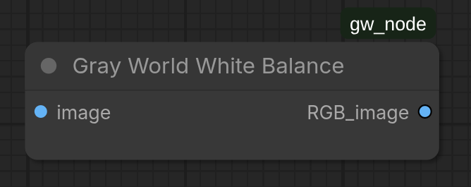

#### Input Parameters

| Input | Tensor Shape | Dtype | Range | Notes |
|-------|--------------|-------|-------|-------|
| **image** | (H, W, 3) | float32 | [0, 1] | RGB from Demosaicing node |

#### Output Schema

| Output | Tensor Shape | Dtype | Range | Description |
|--------|--------------|-------|-------|-------------|
| **RGB_image** | (H, W, 3) | float32 | [0, 1] | Auto white-balanced image |

#### Algorithm Details

**Mathematical Formulation:**

Compute per-channel means:
$$\mu_R = \text{mean}(\text{image}[:,:,0])$$
$$\mu_G = \text{mean}(\text{image}[:,:,1])$$
$$\mu_B = \text{mean}(\text{image}[:,:,2])$$
$$\mu = \frac{\mu_R + \mu_G + \mu_B}{3}$$

Scale each channel:
$$\text{output}_c = \text{image}_c \times \frac{\mu}{\mu_c}$$

**Zero-Mean Handling:**

If $\mu_c = 0$, the scaling term is set to 1.0 (no scaling for that channel).

### ComfyUI Usage: Gray World

**Step-by-step:**

1. Connect **image** from Demosaicing node
2. No parameters to adjust
3. Connect output to Exposure Compensation node

**When to use:**
- Lighting conditions unknown
- Scene contains diverse colors (likely to average toward gray)
- Automatic processing preferred
- Quick evaluation of image

**When NOT to use:**
- Scene dominated by single color (sunset, underwater, monochrome)
- Specific color temperature desired
- Professional color correction needed

### White Patch Reference

**Description**

White balance using the brightest pixels as a white reference point. Assumes the brightest patch in the image represents white or near-white.

**Status:** Automatic with one parameter  
**Category:** image  
**Outputs:** 1

#### ComfyUI Interface

**Node Name:** `White Patch Reference`  
**Category:** image

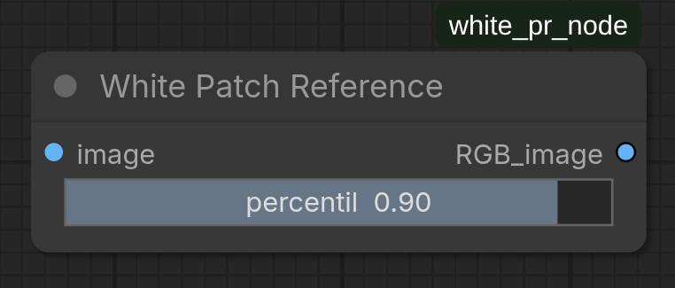

#### Input Parameters

| Input | Tensor Shape | Dtype | Range | Default | Notes |
|-------|--------------|-------|-------|---------|-------|
| **image** | (H, W, 3) | float32 | [0, 1] | — | RGB from Demosaicing node |
| **percentil** | scalar | float | [0, 1] | 0.9 | Percentile threshold for white detection |

#### Output Schema

| Output | Tensor Shape | Dtype | Range | Description |
|--------|--------------|-------|-------|-------------|
| **RGB_image** | (H, W, 3) | float32 | [0, 1] | White-balanced image; clamped to [0,1] |

#### Algorithm Details

**Percentile-Based Max Detection:**

For each channel c, compute the p-th percentile value:
$$V_c = \text{quantile}(\text{image}[:,:,c], \text{percentil})$$

Scale each channel:
$$\text{output}_c = \text{image}_c / V_c$$

**Percentile Parameter:**

- `percentil = 1.0`: Use absolute maximum (standard "white patch")
- `percentil = 0.9`: Use 90th percentile (ignore brightest 10%)
- `percentil = 0.95`: Use 95th percentile (more robust to blown highlights)
- Lower values: More robust to clipped pixels
- Higher values: More aggressive white balance

### ComfyUI Usage: White Patch

**Step-by-step:**

1. Connect **image** from Demosaicing node
2. Set **percentil** slider:
   - Start at 0.9 (default, robust)
   - Increase to 1.0 if white patch is clearly visible
   - Decrease to 0.8 if highlights are blown
3. Connect output to Exposure Compensation node

**When to use:**
- Image contains obvious white or very bright patch (paper, sky, highlight)
- Automatic white balance but with robustness
- No specific color temperature reference available

### Ground Truth White Balance

**Description**

White balance using a user-provided mask identifying a known white or gray patch. Most accurate method if a reference patch is available.

**Status:** Manual reference-based  
**Category:** image  
**Outputs:** 1

#### ComfyUI Interface

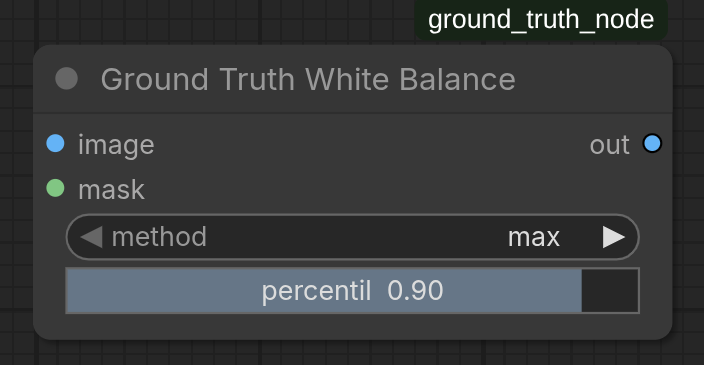

**Node Name:** `Ground Truth White Balance`  
**Category:** image

#### Input Parameters

| Input | Tensor Shape | Dtype | Range | Default | Notes |
|-------|--------------|-------|-------|---------|-------|
| **image** | (H, W, 3) | float32 | [0, 1] | — | RGB from Demosaicing node |
| **mask** | (H, W) | float32 | [0, 1] | — | Binary mask [0=ignore, 1=reference patch] |
| **method** | ENUM | — | ["max", "mean"] | "max" | Detection method within mask |
| **percentil** | scalar | float | [0, 1] | 0.9 | Percentile (only for "max" method) |

#### Output Schema

| Output | Tensor Shape | Dtype | Range | Description |
|--------|--------------|-------|-------|-------------|
| **RGB_image** | (H, W, 3) | float32 | [0, 1] | White-balanced image; clamped to [0,1] |

#### Algorithm Details

**Patch Extraction:**

Extract pixels from masked region:
$$\text{patch} = \text{image}[\text{mask} > 0]$$

**Method: "max"**

Use brightest pixel in patch (with percentile robustness):
$$V_c = \text{quantile}(\text{patch}[:, c], \text{percentil})$$
$$\text{output}_c = \text{image}_c / V_c$$

**Method: "mean"**

Use average of patch as reference:
$$\mu_c = \text{mean}(\text{patch}[:, c])$$
$$\text{output}_c = \text{image}_c \times \frac{\text{mean}(\text{image})}{\mu_c}$$

### ComfyUI Usage: Ground Truth

**Step-by-step:**

1. Create a mask in an image editor:
   - White (value=1) in the white/gray reference region
   - Black (value=0) everywhere else
   - Save as PNG or import from another node
2. Connect **image** from Demosaicing node
3. Connect **mask** from your mask source
4. Choose **method**:
   - "max": Patch's brightest pixel is white
   - "mean": Patch's average is gray
5. Adjust **percentil** (for "max" method only)
6. Connect output to Exposure Compensation node

**When to use:**
- You captured a white or gray card in the scene
- Professional color correction required
- Exact color temperature match needed
- Mask can be easily drawn or generated

### White Balance Comparison

**Description**

Specialized node that applies three white balance methods (Camera, Gray World, White Patch) simultaneously for side-by-side comparison. Useful for evaluating which method produces best results without switching nodes.

**Status:** Comparison/evaluation tool  
**Category:** image  
**Outputs:** 3

#### ComfyUI Interface

**Node Name:** `Camera White Balance + Compare`  
**Category:** image

#### Input Parameters

| Input | Tensor Shape | Dtype | Range | Default | Notes |
|-------|--------------|-------|-------|---------|-------|
| **image** | (H, W, 3) | float32 | [0, 1] | — | RGB from Demosaicing node |
| **wb_gains** | (3,) or (4,) | float32 | >0 | — | From RAW Input node |
| **strength** | scalar | float | [0, 2.0] | 1.0 | Camera WB strength |
| **compare_percentil** | scalar | float | [0, 1] | 0.9 | Percentile for White Patch method |

#### Output Schema

| Output | Tensor Shape | Dtype | Range | Description |
|--------|--------------|-------|-------|-------------|
| **camera_wb_image** | (H, W, 3) | float32 | [0, 1] | Camera white balance result |
| **gray_world_image** | (H, W, 3) | float32 | [0, 1] | Gray World white balance result |
| **white_patch_image** | (H, W, 3) | float32 | [0, 1] | White Patch white balance result |

### ComfyUI Usage: White Balance Comparison

**Step-by-step:**

1. Connect **image** from Demosaicing node
2. Connect **wb_gains** from RAW Input node
3. Adjust sliders:
   - **strength:** Camera WB intensity (0-2.0)
   - **compare_percentil:** White Patch threshold (0-1)
4. Connect all 3 outputs to display nodes or downstream processing
5. Compare the three results to choose best method

**When to use:**
- Evaluating which white balance method works best
- Testing parameter combinations
- Educational purposes (comparing different approaches)

---

## Exposure Compensation

### Description

Adjusts image brightness using the standard EV (Exposure Value) scale. Each +1 EV doubles brightness; each -1 EV halves it. Linear scaling in the linear space (before gamma).

**Status:** Optional, recommended before Gamma  
**Category:** image/processing  
**Outputs:** 1

### ComfyUI Interface

**Node Name:** `Exposure Compensation`  
**Category:** image/processing

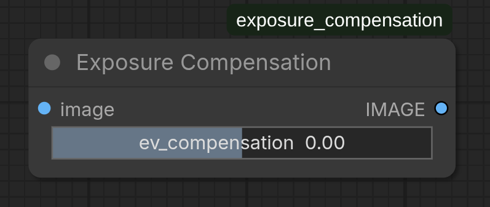

#### Input Parameters

| Input | Tensor Shape | Dtype | Range | Default | Notes |
|-------|--------------|-------|-------|---------|-------|
| **image** | (H, W, 3) | float32 | [0, 1] | — | RGB from White Balance node |
| **ev_compensation** | scalar | float | [-10, 10] | 0.0 | EV stops adjustment |

#### Output Schema

| Output | Tensor Shape | Dtype | Range | Description |
|--------|--------------|-------|-------|-------------|
| **RGB_image** | (H, W, 3) | float32 | [0, ∞] | Exposure-adjusted image (may exceed [0,1]) |

### Algorithm Details

**EV to Gain Conversion:**

$$\text{gain} = 2^{\text{ev\_compensation}}$$

**Application:**

$$\text{output} = \text{image} \times \text{gain}$$

**EV Scale Examples:**

| EV | Gain | Effect |
|:--:|:----:|--------|
| -3.0 | 0.125 | 8× darker |
| -2.0 | 0.25 | 4× darker |
| -1.0 | 0.5 | 2× darker |
| 0.0 | 1.0 | No change |
| +1.0 | 2.0 | 2× brighter |
| +2.0 | 4.0 | 4× brighter |
| +3.0 | 8.0 | 8× brighter |
| +10.0 | 1024.0 | 1024× brighter |

**Important:** No clipping in this stage; values can exceed [0, 1]. Clipping happens during gamma correction or export.

### ComfyUI Usage

**Step-by-step:**

1. Connect **image** from White Balance node
2. Adjust **ev_compensation** slider:
   - Negative values: Darken
   - Positive values: Brighten
   - Start at ±1 for visible effect
3. Connect output to Gamma Correction node

**Visual Reference:**

- If image appears underexposed → Increase EV (add 0.5 to 2.0 stops)
- If image appears overexposed → Decrease EV (subtract 0.5 to 2.0 stops)

### Python API

```python
from src.algorithms.exposure_compensation._exposure_compensation import exposure_compensation
import torch

# Load RGB image
image = torch.rand(3456, 5184, 3)

# Apply +2 stops of exposure compensation
result = exposure_compensation(
    rgb_image=image,
    ev_compensation=2.0
)
```

---

## Gamma Correction

### Description

Applies power-law transformation to adjust perceptual brightness. Essential for converting from linear sensor space to perceptual device space (sRGB standard uses γ=2.2).

**Status:** Highly recommended before export  
**Category:** image  
**Outputs:** 1

### ComfyUI Interface

**Node Name:** `Gamma Correction`  
**Category:** image

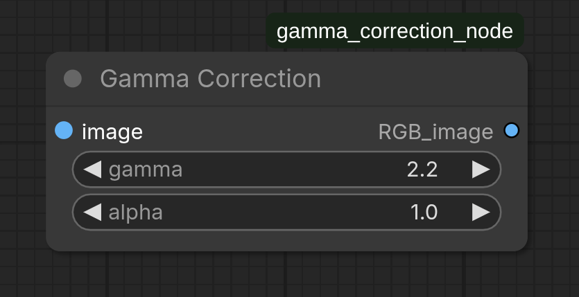

#### Input Parameters

| Input | Tensor Shape | Dtype | Range | Default | Notes |
|-------|--------------|-------|-------|---------|-------|
| **image** | (H, W, 3) | float32 | [0, 1] | — | RGB from Exposure Compensation node |
| **gamma** | scalar | float | (0, ∞] | 2.2 | Gamma exponent; sRGB standard = 2.2 |
| **alpha** | scalar | float | [0, ∞] | 1.0 | Multiplicative scaling factor |

#### Output Schema

| Output | Tensor Shape | Dtype | Range | Description |
|--------|--------------|-------|-------|-------------|
| **RGB_image** | (H, W, 3) | float32 | [0, 1] | Gamma-corrected image; clamped to [0,1] |

### Algorithm Details

**Power-Law Transformation:**

$$\text{output} = \alpha \times (\text{image} + \epsilon)^{1/\gamma}$$

where $\epsilon = 10^{-6}$ (prevents division by zero for very small values).

**Parameters:**

- **gamma:** Exponent; inverse is applied (1/γ)
- **alpha:** Multiplier after gamma; useful for combined brightness adjustment

**Common Gamma Values:**

| Gamma | Use Case | Description |
|:-----:|----------|-------------|
| 1.0 | Linear (no correction) | For linear image data |
| 2.0 | Approximate sRGB | Simple approximation |
| 2.2 | sRGB standard (decode) | Display color space; most common |
| 2.4 | ISO 12646 (film) | Professional film scanning |
| 0.45 ≈ 1/2.2 | sRGB encode | Converting display → linear |

### ComfyUI Usage

**Step-by-step:**

1. Connect **image** from Exposure Compensation node (or White Balance if no exposure adjustment)
2. Set **gamma**:
   - Default 2.2 for standard sRGB output (recommended)
   - Adjust to 2.0-2.4 for specific color space requirements
3. Set **alpha** (usually leave at 1.0):
   - \>1.0: Additional brightening after gamma
   - <1.0: Additional darkening after gamma
4. Connect **RGB_image** to JPEG Export node

**Decode vs. Encode:**

```
Linear sensor data
    ↓ [Gamma 2.2, alpha 1.0] → Decode to sRGB
    ↓
sRGB display image
```

```
sRGB display image
    ↓ [Gamma 0.45, alpha 1.0] → Encode back to linear
    ↓
Linear sensor data
```

### Python API

```python
from src.algorithms.gamma_correction.gamma_correction import gamma_correction
import torch

# Load RGB image (linear light)
image = torch.rand(3456, 5184, 3)

# Apply sRGB gamma correction (standard)
srgb_image = gamma_correction(
    img=image,
    gamma=2.2,
    alpha=1.0
)
```

---

## JPEG Export Node

### Description

Saves the final processed RGB image as JPEG file. Terminal node (produces file output, no image outputs).

**Status:** Final stage  
**Category:** image/export  
**Output Node:** Yes (terminal)

### ComfyUI Interface

**Node Name:** `Save JPEG (Custom Path)`  
**Category:** image/export

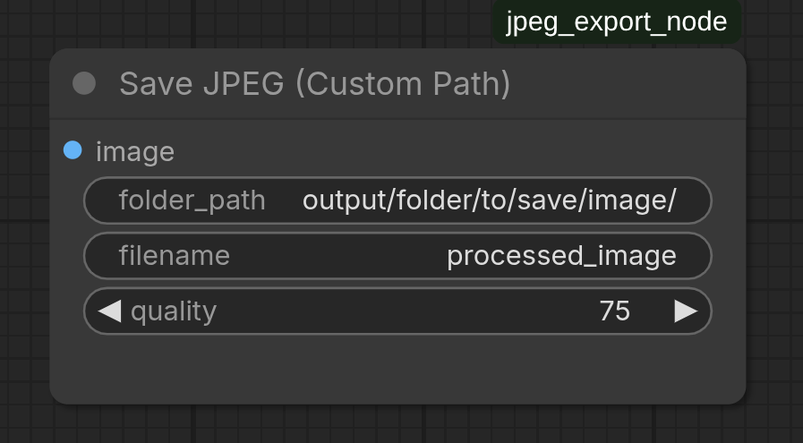

#### Input Parameters

| Input | Tensor Shape | Dtype | Range | Default | Notes |
|-------|--------------|-------|-------|---------|-------|
| **image** | (H, W, 3) or (B, H, W, 3) | float32 | [0, 1] | — | RGB from Gamma Correction (or last processing stage) |
| **folder_path** | STRING | — | Valid path | "./output" | Directory where file will be saved |
| **filename** | STRING | — | Valid filename | "processed_image" | Filename without extension (.jpg added) |
| **quality** | INT | — | [1, 100] | 75 | JPEG quality factor |

#### Output Schema

| Output | Type | Description |
|--------|------|-------------|
| None | Terminal | Saves file; produces no image output |

### Algorithm Details

**Processing Steps:**

1. **Batch Handling:** If input has batch dimension (B, H, W, 3), uses first image
2. **Dtype Conversion:** Converts float [0, 1] to uint8 [0, 255]
   - Multiplies by 255
   - Clamps to [0, 255]
3. **Special Value Handling:**
   - NaN → 0 (black)
   - +∞ (positive infinity) → 255 (white)
   - -∞ (negative infinity) → 0 (black)
4. **File Operations:**
   - Checks folder_path exists
   - Validates not a file path
   - Prevents overwriting existing files (error raised)
5. **JPEG Encoding:** Uses `torchvision.io.write_jpeg()` with quality parameter

**Quality Parameter:**

- **1-30:** Very low quality, small file size
- **50-75:** Good balance (default 75)
- **85-95:** High quality, larger file size
- **100:** Maximum quality (lossless equivalent)

### ComfyUI Usage

**Step-by-step:**

1. Connect **image** from Gamma Correction node
2. Set parameters:
   - **folder_path:** Directory for output (create if doesn't exist first)
   - **filename:** Name without `.jpg` extension
   - **quality:** 75 is good default (adjust 50-95 for your needs)
3. Execute workflow; file is saved immediately
4. Check console for confirmation message

**Example:**

```
folder_path: ./output
filename: vacation_shot_01
quality: 85
→ Saves as: ./output/vacation_shot_01.jpg
```

### Python API

```python
from src.algorithms.export.jpeg_export import export_jpeg
import torch

# Load final RGB image
image = torch.rand(3456, 5184, 3, dtype=torch.float32)

# Export
export_jpeg(
    image=image,
    path="./output/my_image.jpg",
    quality=85
)

print("JPEG saved!")
```

### File System Safety

| Check | Behavior |
|-------|----------|
| Folder doesn't exist | Raises ValueError |
| Path is a file, not folder | Raises ValueError |
| File already exists | Raises ValueError (prevents overwriting) |
| Permission denied | Raises PermissionError |

---

## Complete Pipeline Examples

### Example: Basic Processing (Automatic White Balance)

**Scenario:** Process a Sony RAW file with automatic color correction

**Nodes:**
1. Read RAW Sensor
2. Black Level Subtraction
3. Malvar-He-Cutler Demosaicing (high quality)
4. Gray World White Balance (automatic)
5. Exposure Compensation (if needed)
6. Gamma Correction
7. Save JPEG

**ComfyUI Steps:**

```
1. Add Node: image → "Read RAW Sensor"
   └─ Set image_path: input/sample.arw

2. Add Node: image → "Black Level Subtraction"
   └─ Connect: raw_img, cfa_pattern, black_levels, white_level

3. Add Node: image/processing → "Malvar-He-Cutler Demosaicing"
   └─ Connect: bayer_img, cfa_pattern

4. Add Node: image → "Gray World White Balance"
   └─ Connect: image

5. Add Node: image/processing → "Exposure Compensation"
   └─ Connect: image
   └─ Set ev_compensation: 0.0 (or adjust)

6. Add Node: image → "Gamma Correction"
   └─ Connect: image
   └─ Set gamma: 2.2 (sRGB default)

7. Add Node: image/export → "Save JPEG (Custom Path)"
   └─ Connect: image
   └─ Set folder_path: ./output
   └─ Set filename: processed_image
   └─ Set quality: 85
```

**Expected Output:** `./output/processed_image.jpg` with automatic color correction

**Execution Time:** ~1-2 seconds (depends on image resolution)

## Python API Usage (Without ComfyUI)

For batch processing or programmatic workflows outside ComfyUI, use the algorithms directly.

### Setup & Imports

```python
import torch
from pathlib import Path

# Add source to path if needed
import sys
sys.path.insert(0, '/path/to/image-processing/src')

# Imports for each module
from algorithms.raw.reader import read_raw_sensor_data
from algorithms.black_light_subtraction.black_light_subtraction import linearize_raw
from algorithms.demosaicing._bilinear import bilinear_demosaicing
from algorithms.demosaicing._malvar_he_culter import malvar_he_cutler_demosaicing
from algorithms.white_balance._camera_white_balance import camera_white_balance
from algorithms.white_balance._gray_world import gw
from algorithms.white_balance._white_patch_reference import white_patch_ref
from algorithms.white_balance._ground_truth import ground_truth
from algorithms.exposure_compensation._exposure_compensation import exposure_compensation
from algorithms.gamma_correction.gamma_correction import gamma_correction
from algorithms.export.jpeg_export import export_jpeg
```

### Complete Pipeline Script

```python
# Full processing pipeline in Python

import torch
from pathlib import Path
import sys
sys.path.insert(0, 'src')

from algorithms.raw.reader import read_raw_sensor_data
from algorithms.black_light_subtraction.black_light_subtraction import linearize_raw
from algorithms.demosaicing._malvar_he_culter import malvar_he_cutler_demosaicing
from algorithms.white_balance._gray_world import gw
from algorithms.exposure_compensation._exposure_compensation import exposure_compensation
from algorithms.gamma_correction.gamma_correction import gamma_correction
from algorithms.export.jpeg_export import export_jpeg

# Input file
raw_file = "input/sample.arw"
output_dir = "./output"
output_file = "processed_image.jpg"

# Step 1: Read RAW
print("Step 1: Reading RAW file...")
raw_data, metadata = read_raw_sensor_data(raw_file)
black_levels = torch.tensor(metadata['black_levels'], dtype=torch.float32)
white_level = torch.tensor([metadata['white_level']], dtype=torch.float32)

# Create CFA pattern (assuming RGGB)
H, W = raw_data.shape
cfa_pattern = torch.zeros((H, W), dtype=torch.int32)
cfa_pattern[0::2, 0::2] = 0  # Red
cfa_pattern[0::2, 1::2] = 1  # Green
cfa_pattern[1::2, 0::2] = 3  # Green
cfa_pattern[1::2, 1::2] = 2  # Blue

# Step 2: Linearize (Black Level Subtraction)
print("Step 2: Linearizing RAW...")
bayer_img, pattern = linearize_raw(raw_data, cfa_pattern, black_levels, white_level)

# Step 3: Demosaicing
print("Step 3: Demosaicing (Malvar-He-Cutler)...")
rgb_img = malvar_he_cutler_demosaicing(bayer_img, dx=0, dy=0)

# Step 4: White Balance
print("Step 4: White Balance (Gray World)...")
wb_img = gw(rgb_img)

# Step 5: Exposure Compensation (optional)
print("Step 5: Exposure Compensation...")
exp_img = exposure_compensation(wb_img, ev_compensation=0.5)  # +0.5 stops

# Step 6: Gamma Correction
print("Step 6: Gamma Correction...")
gamma_img = gamma_correction(exp_img, gamma=2.2, alpha=1.0)

# Step 7: Export
print("Step 7: Exporting to JPEG...")
Path(output_dir).mkdir(exist_ok=True)
export_jpeg(gamma_img, f"{output_dir}/{output_file}", quality=85)

print(f"✓ Saved to {output_dir}/{output_file}")
```

**Output:**
```
Step 1: Reading RAW file...
Step 2: Linearizing RAW...
Step 3: Demosaicing (Malvar-He-Cutler)...
Step 4: White Balance (Gray World)...
Step 5: Exposure Compensation...
Step 6: Gamma Correction...
Step 7: Exporting to JPEG...
✓ Saved to ./output/processed_image.jpg
```

---

## Best Practices

### Data Types & Tensor Shapes

**Strict Compliance Required**

Always verify tensor shapes and dtypes match expected input:

| Node | Expected Shape | Dtype | Common Mistake |
|------|---|---|---|
| RAW Reader output | (H, W) | float32 | Confusing with (H, W, 1) |
| Linearized Bayer | (H, W, 1) or (H, W) | float32 | dtype uint16 causes crash |
| Demosaiced RGB | (H, W, 3) | float32 | uint8 not supported |
| JPEG Export input | (H, W, 3) | float32 | Shape (H, W, 1) fails |

**Validation Code:**
```python
assert rgb_img.ndim == 3, f"Expected 3D, got {rgb_img.ndim}D"
assert rgb_img.shape[2] == 3, f"Expected last dim=3, got {rgb_img.shape[2]}"
assert rgb_img.dtype == torch.float32, f"Expected float32, got {rgb_img.dtype}"
```

### Pipeline Order & Dependencies

**Always follow recommended order:**

```
RAW Input
  → Black Level Subtraction (removes sensor offset)
  → Demosaicing (Bayer → RGB)
  → White Balance (color temperature)
  → Exposure Compensation (brightness)
  → Gamma Correction (perceptual brightness)
  → Export
```

**Why this matters:**
- Linearization must come before demosaicing (demosaicing assumes linear data)
- White balance before exposure (WB works in linear; exposure affects perceived color)
- Gamma after exposure (correct perceptual brightness mapping)

## Appendix

### Glossary

**CFA (Color Filter Array):** Physical pattern of color filters on sensor; most common is Bayer pattern

**Bayer Pattern:** 2×2 repeating grid with pattern RGGB, BGGR, GRBG, or GBRG

**Black Level:** Sensor output when no light hits (noise floor)

**White Level:** Maximum sensor output value (typically 65535 for 16-bit)

**Linearization:** Removing black level and normalizing to [0, 1] range

**Demosaicing:** Interpolating full RGB from sparse Bayer mosaic

**WB (White Balance):** Color temperature correction by scaling RGB channels

**ISP:** Image Signal Processing pipeline (RAW input → JPEG output)

**EV (Exposure Value):** Standard scale for brightness; +1 EV = 2× brightness

**Gamma:** Perceptual brightness exponent (sRGB standard = 2.2)

**sRGB:** Standard RGB color space with gamma correction (γ=2.2)

### Terms by Color Channel

| Term | Abbreviation | Meaning |
|------|--------------|---------|
| Red | R | Red channel (640 nm wavelength) |
| Green | G | Green channel (splits into two in Bayer) |
| Blue | B | Blue channel (450 nm wavelength) |

### External References

- **RAW Image Format:** [DNG Specification](https://helpx.adobe.com/camera-raw/digital-negative.html)
- **Demosaicing:** Malvar et al., "High-Quality Linear Interpolation for Demosaicing of Bayer-Patterned Color Images"
- **sRGB:** [IEC 61966-2-1 Standard](https://en.wikipedia.org/wiki/SRGB)

---

**Document Version:** 1.0  
**Last Updated:** March 27, 2026  
**Compatibility:** Python 3.13+, PyTorch 2.0+, ComfyUI latest 
